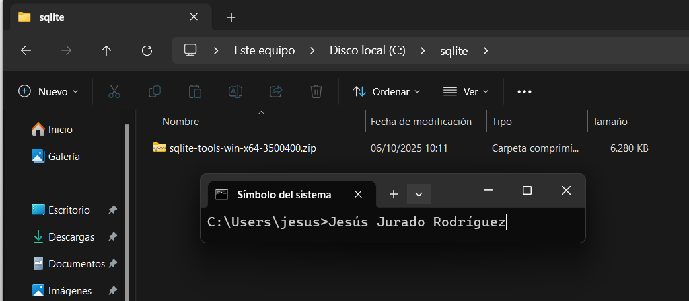
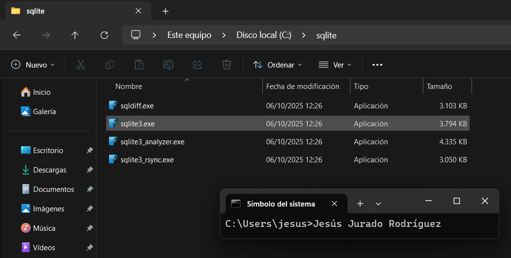
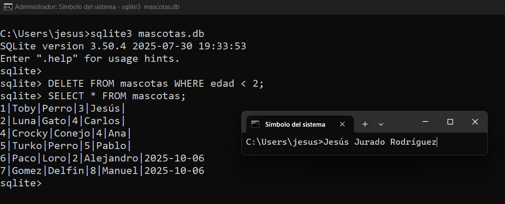

## Práctica: Ejemplo básico de instalación y uso de un SGBDR ligero.

### 1. Sistemas de ficheros.

- Crea un fichero con la información de 5 mascotas.
- Analiza los problemas que pueden aparecer en la gestión de la información al trabajar con ficheros.


### 2. Instalación de SQLite
   
En Windows -->

   1. Descarga SQLite desde la página oficial: https://www.sqlite.org/download.html
   2. Descarga el archivo sqlite-tools para Windows.



   3. Descomprime la carpeta en C:\sqlite.



   4. Abre la terminal CMD o PowerShell.
   5. Agrega la ruta C:\sqlite a las variables de entorno del sistema.


Comprobar instalación:


### 3. Creación de la base de datos

Abrir terminal y ejecutar; Aparecerá el prompt de SQLite.:


### 4. Creación de tablas y Insercción de datos

```
CREATE TABLE mascotas (
id INTEGER PRIMARY KEY AUTOINCREMENT,
nombre TEXT NOT NULL,
especie TEXT NOT NULL,
edad INTEGER,
dueño TEXT
);
```

Comprobar que la tabla existe:


### 5. Consultas básicas

Ver todos los registros, Ver solo los gatos; Contar cuántas mascotas hay:


### 6. Actualización y eliminación
   
Actualizar la edad de "Luna"; Eliminar al pez "Nemo":


### 7. Tareas
   
1. Inserta al menos 3 mascotas más de distintas especies.


2. Crea una consulta que muestre solo los nombres y edades de los perros.


3. Modifica la tabla para añadir un nuevo campo fecha_registro de tipo DATE.


4. Inserta la fecha de registro en las nuevas mascotas.


5. Elimina todas las mascotas con edad menor a 2 años.




